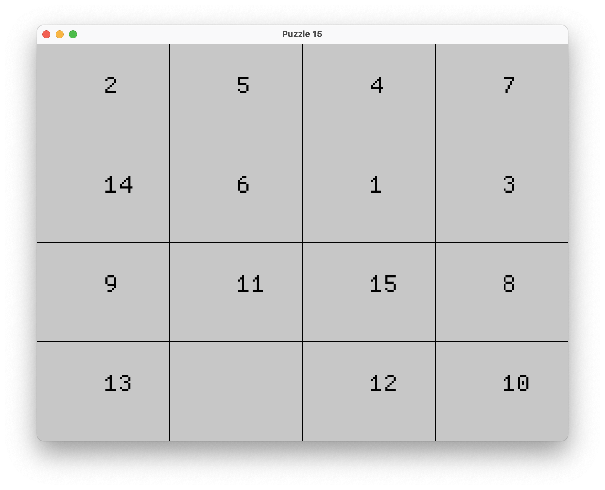
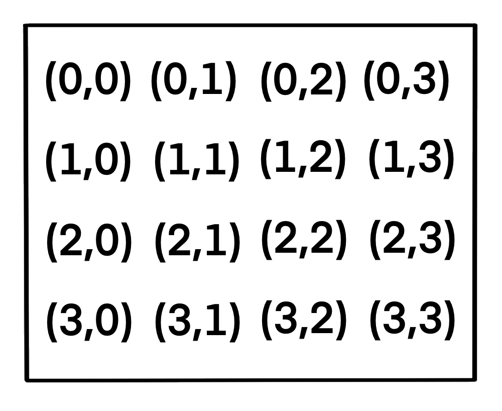

<div align="center">
    
</div>

# Simple implementation of puzzle 15 on Rust

## Launch

```bash
git clone https://github.com/wbwswt/puzzle15.git
cd puzzle15
cargo run --release
```

You can build project for different platforms including WASM, please follow the [instruction] (https://github.com/not-fl3/miniquad/#building-examples)

## Inner coordinate system

If you want to make changes to the project, it would be useful to know how the coordinates are represented internally. The way t is chosen is as intuitive as possible

<div align="center">
    
</div>

